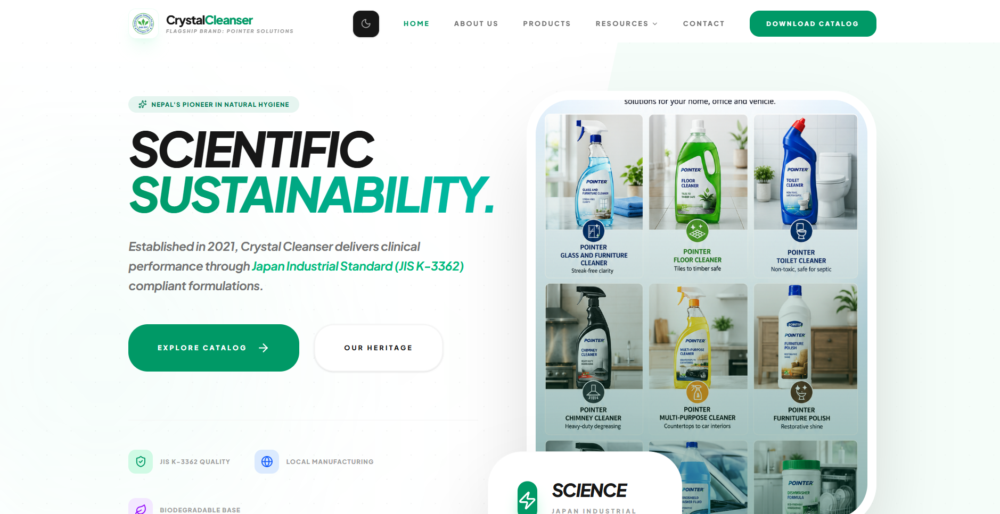
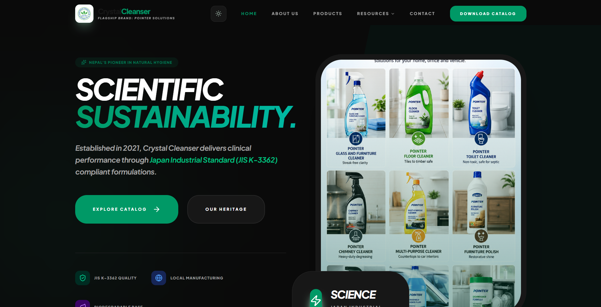
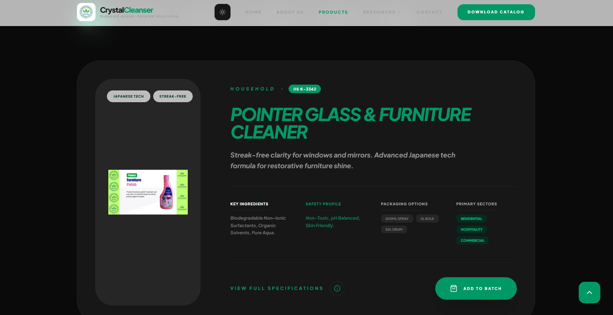
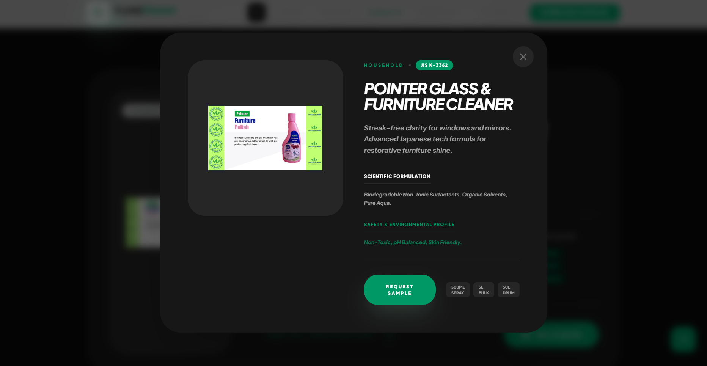
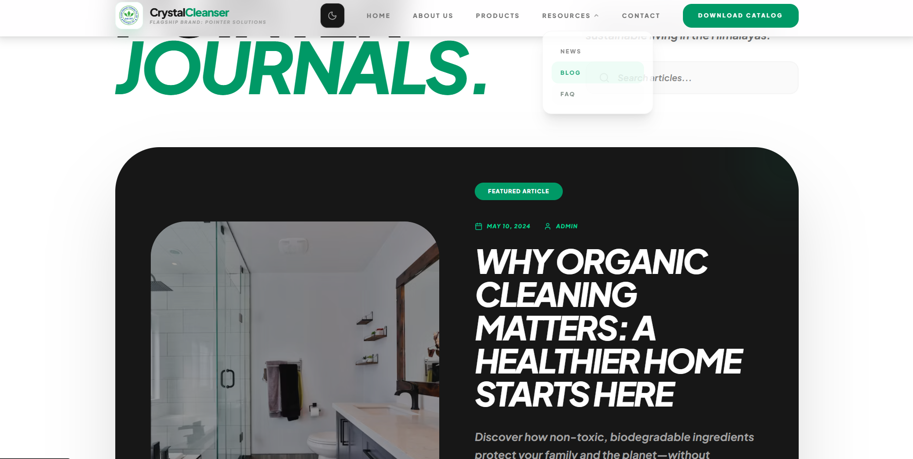
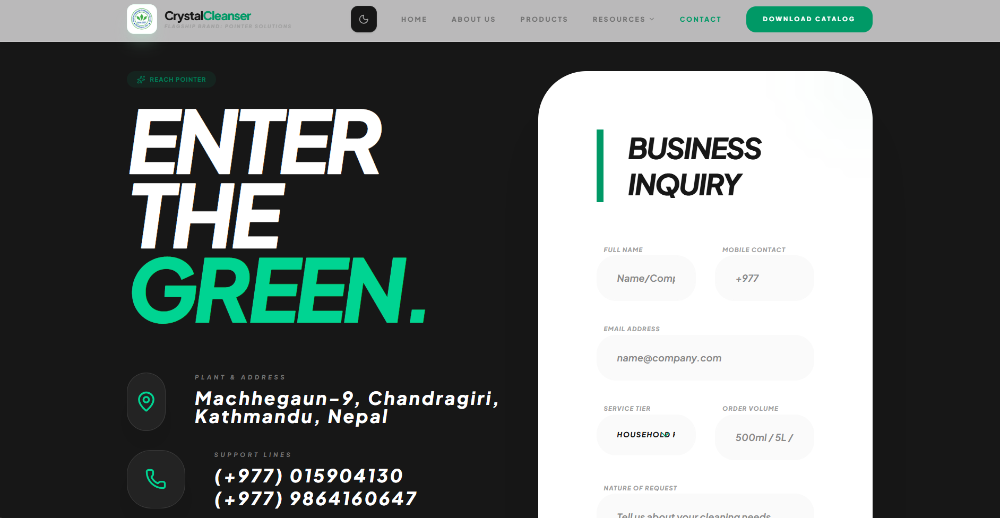

# Crystal Cleanser

**Nepal's Pioneer in Natural Hygiene — Scientific Sustainability.**

A modern, fully responsive product showcase web application for Crystal Cleanser, a Nepal-based eco-friendly cleaning products brand. Built with React, TypeScript, and Vite, the site delivers a premium digital experience for the Pointer product lineup — formulated to Japan Industrial Standard (JIS K-3362).

---

## Screenshots / Demo

**Dashboard (Light Mode)**


**Dashboard (Dark Mode)**


**Products Page**


**Product Detail**


**Blog Page**


**Contact & Scan**


**Contact Page**


---

## Features

- **Eco-Product Showcase** — Full catalog of the Pointer product line with detailed ingredient, safety, and packaging information
- **Dark / Light Mode** — Persistent theme toggle stored in `localStorage`
- **Lazy-Loaded Pages** — All routes are code-split via `React.lazy` for faster initial load
- **Animated Page Transitions** — Smooth enter/exit animations on every route via Framer Motion
- **Gemini AI Integration** — Powered by `@google/genai` for intelligent features
- **EmailJS Contact Form** — Functional contact form with client-side email delivery
- **Blog & News Section** — Articles covering eco-cleaning topics, tips, and product guides
- **FAQ Page** — Categorized frequently asked questions
- **Download Page** — Resource/brochure download support
- **Animated Counters** — Spring-physics-based counters that animate on scroll into view
- **Back-to-Top Button** — Smooth scroll-to-top utility component
- **Fully Responsive** — Mobile-first layout across all pages
- **Toast Notification System** — Global toast provider for user feedback
- **Multi-sector Coverage** — Products tailored for Healthcare, Hospitality, Education & Residential sectors

---

## Tech Stack

| Category        | Technology                             |
|-----------------|----------------------------------------|
| Framework       | React 19                               |
| Language        | TypeScript 5.8                         |
| Bundler         | Vite 6                                 |
| Styling         | Tailwind CSS 4                         |
| Routing         | React Router DOM 7                     |
| Animation       | Motion (Framer Motion) 12              |
| Icons           | Lucide React + React Icons             |
| AI              | Google Generative AI (`@google/genai`) |
| Email           | EmailJS Browser (`@emailjs/browser`)   |
| Backend         | Express.js (API layer)                 |
| Environment     | dotenv                                 |

---

## Project Architecture

```
Crystal Cleaner/
├── src/
│   ├── pages/                  # Route-level page components
│   │   ├── Home.tsx            # Hero, counters, sectors overview
│   │   ├── About.tsx           # Brand story & heritage
│   │   ├── Products.tsx        # Full product catalog with filters
│   │   ├── Blog.tsx            # Blog post grid
│   │   ├── News.tsx            # News & announcements
│   │   ├── FAQ.tsx             # Categorized FAQ accordion
│   │   ├── Contact.tsx         # EmailJS-powered contact form
│   │   └── Download.tsx        # Brochure / resource downloads
│   │
│   ├── components/             # Shared/reusable UI components
│   │   ├── Navbar.tsx          # Responsive navigation + dark mode toggle
│   │   ├── Footer.tsx          # Site-wide footer
│   │   ├── LoadingScreen.tsx   # Animated intro loading screen
│   │   ├── BackToTop.tsx       # Floating back-to-top button
│   │   ├── ScrollToTop.tsx     # Route-change scroll reset
│   │   ├── SectionTag.tsx      # Section label badge component
│   │   └── Toast.tsx           # Global toast notification provider
│   │
│   ├── context/                # React context providers (reserved)
│   ├── constants.ts            # All static data (PRODUCTS, BLOG_POSTS, FAQS, SECTORS)
│   ├── App.tsx                 # Root app, routing, dark mode context
│   ├── main.tsx                # React DOM entry point
│   └── index.css               # Global styles
│
├── static/                     # Static image assets
├── Products/                   # Product imagery
├── news and publication/       # News media assets
├── dist/                       # Production build output
├── .env.example                # Environment variable template
├── vite.config.ts              # Vite configuration
├── tsconfig.json               # TypeScript configuration
└── package.json
```

---

## Installation

### Prerequisites

- [Node.js](https://nodejs.org/) v18 or higher
- npm v9 or higher

### Steps

```bash
# 1. Clone the repository
git clone https://github.com/your-username/crystal-cleanser.git
cd crystal-cleanser

# 2. Install dependencies
npm install

# 3. Set up environment variables
cp .env.example .env
# Then edit .env with your actual keys (see Configuration section)

# 4. Start the development server
npm run dev
```

The app will be available at **http://localhost:3000**

---

## Configuration

Copy `.env.example` to `.env` and fill in the required values:

```env
# Required for Gemini AI API calls
GEMINI_API_KEY="your_google_gemini_api_key"

# The URL where this app is hosted (used for self-referential links)
APP_URL="http://localhost:3000"
```

| Variable         | Description                                     | Required |
|------------------|-------------------------------------------------|----------|
| `GEMINI_API_KEY` | Google AI Studio API key for Gemini integration | Yes      |
| `APP_URL`        | Deployment URL for callbacks and API references | Yes      |

> **Note:** Obtain your `GEMINI_API_KEY` from [Google AI Studio](https://aistudio.google.com/).

---

## Usage

### Development

```bash
npm run dev       # Start dev server at http://localhost:3000
```

### Production Build

```bash
npm run build     # Build to /dist
npm run preview   # Preview the production build locally
```

### Other Scripts

```bash
npm run lint      # TypeScript type check (no emit)
npm run clean     # Remove the /dist folder
```

### Navigation

| Route        | Page     | Description                             |
|--------------|----------|-----------------------------------------|
| `/`          | Home     | Hero section, counters, sector overview |
| `/about`     | About    | Brand story, values & heritage          |
| `/products`  | Products | Full Pointer product catalog            |
| `/blog`      | Blog     | Cleaning tips & eco-friendly articles   |
| `/news`      | News     | News & press publications               |
| `/faq`       | FAQ      | Frequently asked questions              |
| `/contact`   | Contact  | Contact form & company info             |
| `/download`  | Download | Brochures & resource downloads          |

---

## Folder Structure

```
Crystal Cleaner/
├── src/                        # Application source code
│   ├── components/             # Reusable UI components
│   ├── pages/                  # Full-page route views
│   ├── context/                # React context providers
│   ├── constants.ts            # Centralized static data
│   ├── App.tsx                 # App root + ThemeContext
│   └── main.tsx                # Entry point
│
├── static/                     # Screenshots, banners, logo
├── Products/                   # Product image assets
├── news and publication/       # News/media files
├── dist/                       # Build output (generated)
├── node_modules/               # Dependencies (generated)
│
├── .env                        # Local environment variables (not committed)
├── .env.example                # Environment variable template
├── .gitignore
├── index.html                  # Vite HTML template
├── metadata.json               # App metadata descriptor
├── package.json
├── tsconfig.json
└── vite.config.ts
```

---

## Security Features

- **Environment Variables** — API keys are stored server-side via `.env` and never exposed to the client bundle
- **No Hardcoded Secrets** — `.env.example` template is committed; `.env` is git-ignored
- **Non-Toxic Formulations** — All Pointer products are JIS K-3362 compliant: non-toxic, pH balanced, and child/pet safe
- **Client-Side Email** — EmailJS handles contact form submissions without exposing a backend endpoint
- **TypeScript Strict Mode** — Full type safety enforced via `tsc --noEmit` linting

---

## Testing

Currently, the project uses TypeScript type-checking as the primary static analysis tool:

```bash
npm run lint      # Runs: tsc --noEmit
```

> **Future:** Unit tests with Vitest and React Testing Library are planned (see Future Improvements).

---

## Future Improvements

- [ ] E-Commerce / Order System — Product inquiry cart and bulk order request flow
- [ ] Unit & Integration Tests — Vitest + React Testing Library coverage
- [ ] i18n / Localization — Nepali language support for local users
- [ ] Analytics Dashboard — Internal view counts and engagement tracking
- [ ] Product Search — Full-text search and advanced filtering across the catalog
- [ ] PWA Support — Offline-first Progressive Web App with service workers
- [ ] AI Product Advisor — Expanded Gemini AI chatbot for product recommendations
- [ ] CMS Integration — Headless CMS for blog and news content management

---

## License

This project is licensed under the **MIT License**.
See the [LICENSE](./LICENSE) file for full details.

---

## Author / Contact

**Crystal Cleanser — Pointer Brand**
Location: Nepal
Established: 2021
Standard: JIS K-3362 Compliant

| Channel  | Details                                                                 |
|----------|-------------------------------------------------------------------------|
| Website  | [crystalcleanser.com](https://crystalcleanser.com) *(coming soon)*     |
| Email    | Via the [Contact Page](http://localhost:3000/contact)                   |
| Products | [View Full Catalog](http://localhost:3000/products)                     |

---

Built in Nepal · Powered by React, TypeScript & Vite · Formulated to JIS K-3362
